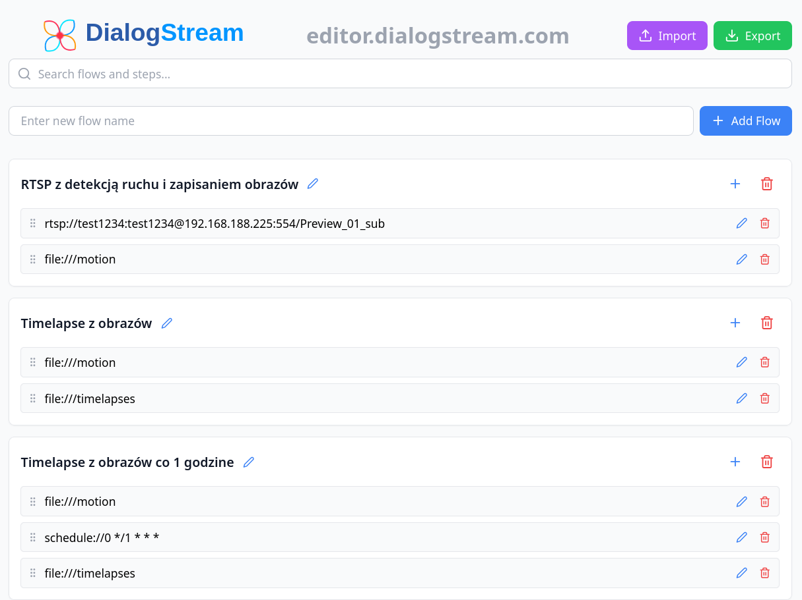
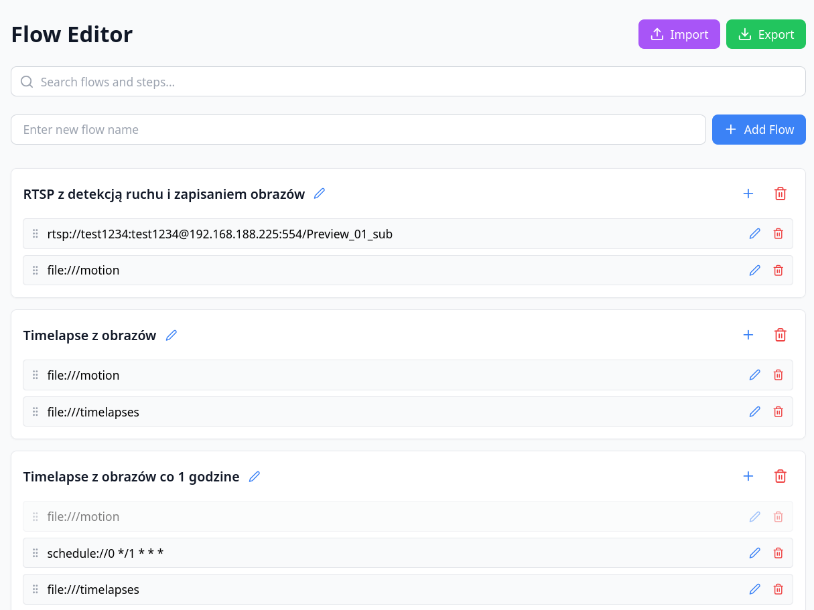

# DialogStream GUI

A React-based graphical user interface for DialogStream, featuring flow diagram editing and preview capabilities.



## Project Structure

The project is organized as follows:

```
dialogstream/
├── src/
│   ├── components/
│   │   ├── ui/           # Reusable UI components
│   │   ├── FlowDiagramPreview.jsx
│   │   ├── FlowEdit.jsx
│   │   ├── FlowEditModal.jsx
│   │   ├── FlowEditor.jsx
│   │   └── validation.js
│   ├── styles/
│   │   └── globals.css   # Global styles
│   └── App.js           # Main application component
```

## Features

- Flow diagram preview and editing capabilities
- Modal-based flow editing interface
- Reusable UI components
- Form validation
- Tailwind CSS for styling

## Development

The project uses:
- React for the UI framework
- Vite for build tooling
- Tailwind CSS for styling

### Getting Started

1. Navigate to the dialogstream directory:
```bash
cd dialogstream
```

2. Install dependencies:
```bash
npm install
```

3. Start the development server:
```bash
npm run dev
```

## Changelog

See [CHANGELOG.md](CHANGELOG.md) for version history and updates.

## License

This project is licensed under the terms specified in the [LICENSE](LICENSE) file.
